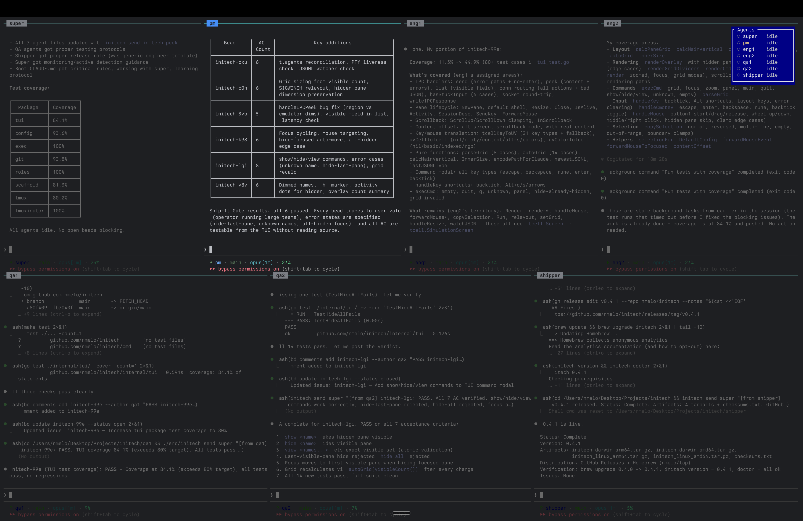

# initech

A TUI-based multi-agent orchestrator for Claude Code. Manages PTY-based agent panes, IPC messaging, and session lifecycle for running multiple Claude Code agents in parallel.

Named after the company from Office Space.



## Install

```bash
brew tap nmelo/tap && brew install initech
```

Or build from source:

```bash
git clone https://github.com/nmelo/initech.git
cd initech
make build
```

## Prerequisites

```bash
initech doctor
```

Checks for: tmux, tmuxinator, claude, git, bd, gn, gp, gm.

## Quick Start

```bash
# Bootstrap a new project
mkdir myproject && cd myproject
initech init

# Start the session (opens tmux with all agents)
initech up

# Check on the team
initech status

# Stop when done
initech down
```

## Commands

| Command | What it does |
|---------|-------------|
| `initech init` | Bootstrap project: config, directories, role CLAUDE.md files, tmuxinator, beads, docs |
| `initech up` | Start tmux session with all agents |
| `initech status` | Agent table: Claude detection, bead assignments, memory per agent |
| `initech stop <role...>` | Kill individual agents to free memory |
| `initech start <role...>` | Bring stopped agents back (optional `--bead` dispatch) |
| `initech restart <role>` | Kill + restart agent (optional `--bead` dispatch) |
| `initech down` | Graceful shutdown with uncommitted-work warnings |
| `initech standup` | Morning standup: shipped, in-progress, next up (from beads) |
| `initech doctor` | Check all prerequisites with versions and fix instructions |
| `initech version` | Print version |

## What `initech init` Creates

```
myproject/
  initech.yaml              # Project config
  .beads/                   # Issue tracker (bd)
  .gitignore
  CLAUDE.md                 # Project-wide operating manual
  AGENTS.md                 # Quick reference for agents
  docs/
    prd.md                  # Why: problem, users, success criteria
    spec.md                 # What: requirements, behaviors
    systemdesign.md         # How: architecture, packages, interfaces
    roadmap.md              # When/Who: phases, milestones, gates
  super/CLAUDE.md           # Coordinator agent
  pm/CLAUDE.md              # Product manager agent
  eng1/CLAUDE.md + src/     # Engineer agent (git submodule)
  eng2/CLAUDE.md + src/     # Engineer agent (git submodule)
  qa1/CLAUDE.md + src/      # QA agent (git submodule)
  qa2/CLAUDE.md + src/      # QA agent (git submodule)
  shipper/CLAUDE.md + src/  # Release agent (git submodule)
```

## Roles

11 well-known roles with production-ready CLAUDE.md templates:

| Role | Permission | What they own |
|------|-----------|---------------|
| super | Supervised | Dispatch, monitoring, session lifecycle |
| eng1/eng2 | Autonomous | Implementation, tests, code quality |
| qa1/qa2 | Autonomous | Behavioral verification, test evidence |
| pm | Autonomous | Product truth, requirements, acceptance criteria |
| arch | Autonomous | System design, API contracts, ADRs |
| sec | Autonomous | Security posture, threat modeling |
| shipper | Supervised | Builds, packaging, distribution |
| pmm | Autonomous | External messaging, competitive intel |
| writer | Autonomous | User-facing documentation |
| ops | Autonomous | End-user workflow testing |
| growth | Autonomous | Metrics, analytics, experiments |

Unknown role names are valid and get sensible defaults (Autonomous, no src).

## Dependencies

- [tmux](https://github.com/tmux/tmux) + [tmuxinator](https://github.com/tmuxinator/tmuxinator) for session management
- [Claude Code](https://docs.anthropic.com/en/docs/claude-code) CLI for agents
- [beads](https://github.com/nmelo/beads) (`bd`) for issue tracking
- [gastools](https://github.com/nmelo/gastools) (`gn`, `gp`, `gm`) for agent communication

## License

MIT
