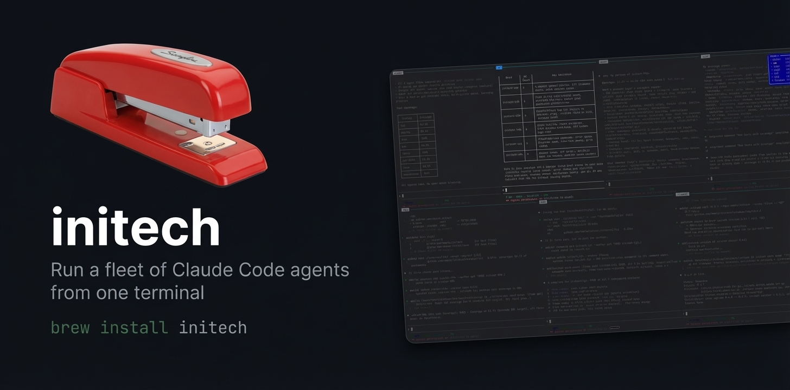

[](https://go.dev)
[](https://opensource.org/licenses/MIT)
[](https://github.com/nmelo/initech)
[](https://github.com/nmelo/homebrew-tap)
[](https://deepwiki.com/nmelo/initech)

<p align="center">
  
</p>

<strong>No tmux required!!</strong>

**initech** is an agent runtime for directing teams of Claude Code agents. Each agent gets its own PTY-backed pane, reliable IPC messaging, and bead-aware state tracking — all in one TUI.

## Why

Running multiple Claude Code agents in tmux breaks in three specific ways:

- **Messages drop silently.** `tmux send-keys` has no delivery guarantee. When a completion report from eng to super drops, the dispatch chain stalls. initech's IPC socket confirms delivery or returns an explicit error.
- **Agent state is invisible.** A hung agent and a productive one look identical in tmux. initech shows every agent's activity state simultaneously — active, idle, stalled, or idle-with-work-waiting.
- **Work is invisible to the runtime.** tmux doesn't know what beads exist or who's working on what. initech parses Claude's session logs for bead events and surfaces them as typed notifications: green toast when an agent finishes, yellow when it stalls, red when it's error-looping.

## Quick Start

```bash
# Install
brew tap nmelo/tap && brew install initech

# Bootstrap a new project
mkdir myproject && cd myproject
initech init

# Launch
initech
```

`initech init` prompts for a project name, lets you pick roles interactively, and scaffolds the full workspace: `initech.yaml`, agent directories with CLAUDE.md files, git submodules, and project documents.

`initech` (no subcommand) launches the TUI. All agent panes start simultaneously.

<p align="center">
  <video src="https://github.com/user-attachments/assets/20a30a27-ea82-40e7-8f64-ee5a2adf2252" autoplay loop muted playsinline controls width="100%"></video>
</p>

## Features

- **Full PTY emulation** — each agent runs in a real terminal with VT100 support
- **Reliable IPC** — `initech send eng1 "message"` delivers or errors; no silent drops
- **Activity detection** — tracks byte flow per agent; idle-at-prompt is the only zero-output state
- **Bead integration** — parses Claude's JSONL session logs for `bd` commands; shows assignments in the ribbon
- **Toast notifications** — work state changes surface automatically, no agent cooperation required
- **Cross-machine support** — run agents across multiple machines; remote panes stream live over TCP
- **13 role templates** — super, pm, arch, eng, qa, shipper, sec, pmm, writer, ops, growth, and more
- **Command modal** — layout control, agent restart, patrol view, activity monitor, all from one bar

## Command Reference

```bash
initech send <role> "message"    # Deliver text to an agent
initech peek <role> [-n lines]   # Read agent terminal output
initech patrol                   # All agents' output in one call
initech status                   # Agent table: activity, bead, alive
initech restart <role>           # Kill and respawn an agent
initech serve                    # Run headless daemon for remote connections
initech peers                    # List connected machines and their agents
initech standup                  # Morning standup from beads
initech doctor                   # Check prerequisites
```

Full CLI reference, configuration options, role catalog, and cross-machine setup: **[Operator Guide](docs/operator-guide.md)**

---

<p align="center">
  
</p>
